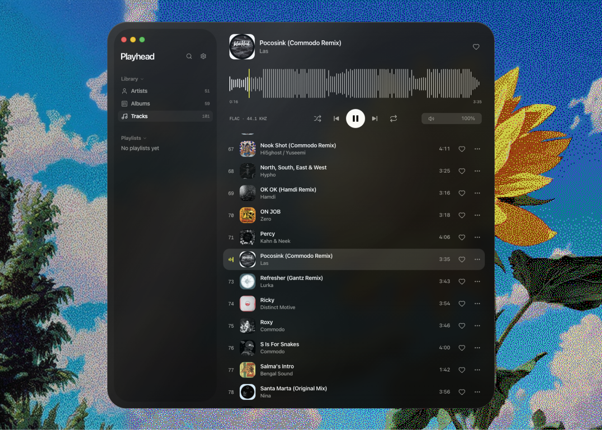
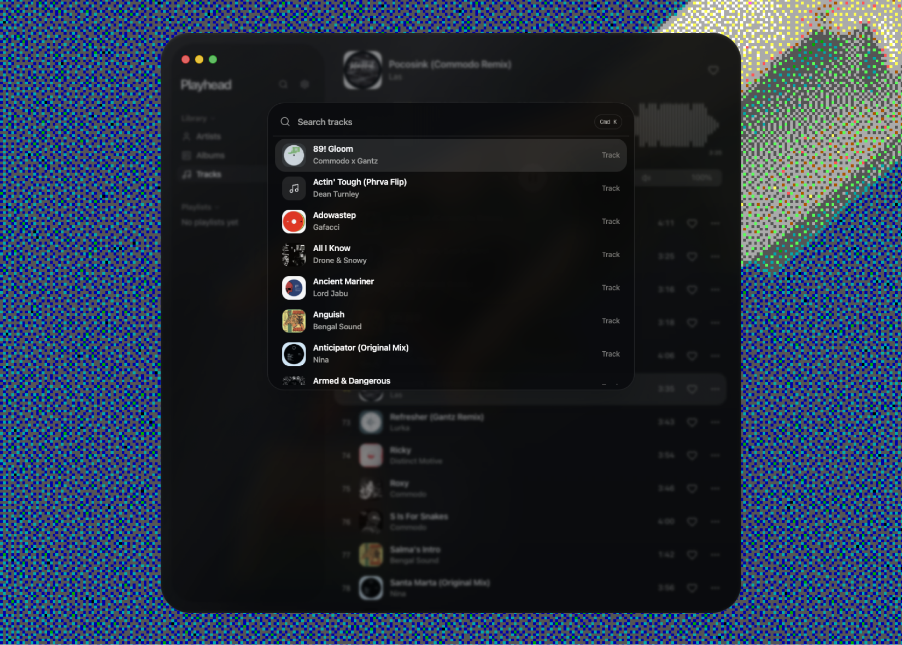
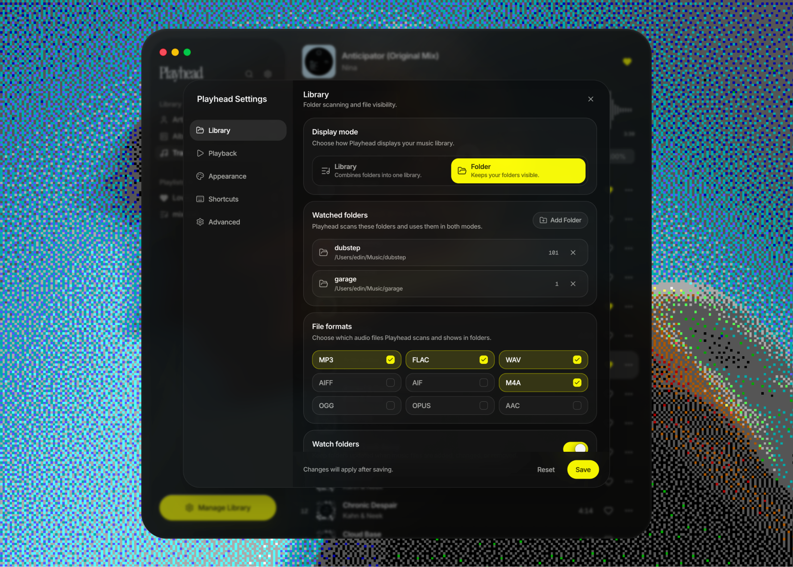
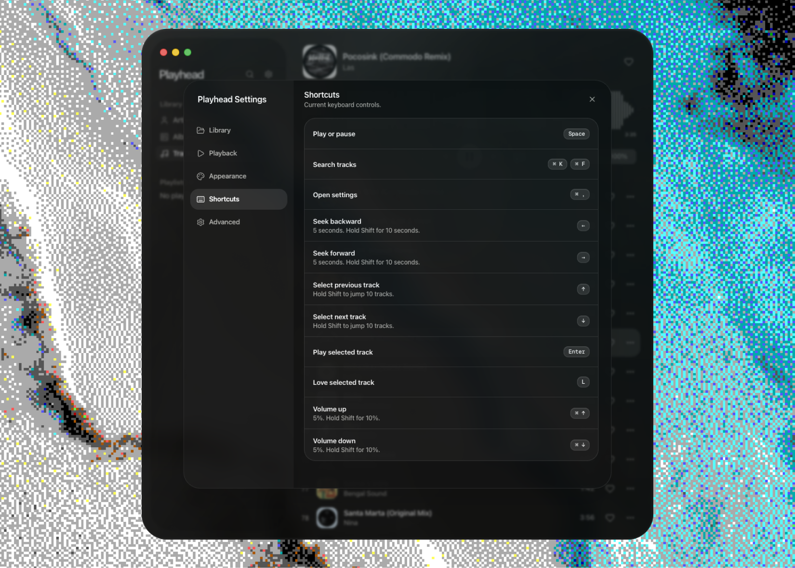

<p align="center">
  
</p>

<h1 align="center">Playhead</h1>

<p align="center">
  A minimal, design-driven, local-first music player for people who still keep their own music files.
</p>

<p align="center">
  <strong>Waveforms.</strong> <strong>Metadata.</strong> <strong>Folders.</strong> <strong>No accounts.</strong> <strong>No ads.</strong>
</p>

<p align="center">
  <strong>Downloads</strong>:
  <a href="https://github.com/edinabazi/playhead/releases/latest/download/Playhead-mac-arm64.dmg">macOS Apple Silicon</a>
  ·
  <a href="https://github.com/edinabazi/playhead/releases/latest/download/Playhead-mac-x64.dmg">macOS Intel</a>
  ·
  <a href="https://github.com/edinabazi/playhead/releases/latest/download/Playhead-win-x64.exe">Windows</a>
  ·
  <a href="https://github.com/edinabazi/playhead/releases/latest/download/Playhead-linux-x86_64.AppImage">Linux AppImage</a>
  ·
  <a href="https://github.com/edinabazi/playhead/releases/latest/download/Playhead-linux-amd64.deb">Linux .deb</a>
  ·
  <a href="https://github.com/edinabazi/playhead/releases/latest/download/Playhead-linux-x64.tar.gz">Linux tar.gz</a>
</p>

---

## Why Playhead exists

Most music apps are either streaming-first, overly complex, ugly, cloud-tied, or built around workflows that do not fit people with real local music collections.

Playhead is for music enthusiasts, DJs, producers, collectors, and anyone who wants a clean desktop player for their own files.

Add your folders. Browse your library. See the waveform. Play tracks quickly. Edit metadata when something is wrong. Keep everything local.

No account. No subscription. No cloud library. No ads. No bloated onboarding. Just your music.

Playhead was designed and built by a designer, developer, and DJ hobbyist who always wanted a simple, modern, waveform-based local music player that felt good to use.

## Screenshots

<p align="center">
  
</p>

<p align="center">
  
</p>

<p align="center">
  
</p>

<p align="center">
  
</p>

## Features

### Two ways to browse your music

Playhead supports two display modes, depending on how you like to organize your collection.

**Library mode** combines your imported folders into one clean music library. Browse by tracks, artists, albums, playlists, and favorites.

**Folder mode** keeps your imported folders visible as the main structure. This is useful for DJs, producers, download folders, exports, set prep, samples, references, and messy real-world music libraries.

### Metadata columns and sorting

Use the **Choose columns** icon at the right of the track list header (or right-click any heading) to show Artist, Album, Album artist, Genre, Disc, Track no., Year, Composer, BPM, or Time. Click a column heading to sort; click again to reverse it. Column choices and sorting are remembered across launches. Text stored in the Disc tag, such as a mood, is preserved and sortable.

**Reset sort** in the column picker restores the original source order and enables manual folder or playlist reordering again. Starting playback from a sorted list uses that order for the new queue. Existing libraries refresh their cached metadata on first launch after this update.

### Local-first playback

Playhead plays audio directly from your machine. Your files stay on disk, and your library state is stored locally.

Supported formats include:

- MP3
- FLAC
- WAV
- AIFF / AIF
- M4A
- OGG
- OPUS
- AAC

### Waveform-based player

Playhead generates and caches waveform data for local audio files, giving you a quick visual sense of the track while you listen.

### Network and external drives

If direct playback fails, Playhead tries a temporary local copy before reporting an error. Copies stay on disk, are reused while the source is unchanged, and are removed when the app quits. Retained copies are limited to two tracks and 512 MB, with room for a single larger recording.

If the source still can't be read, the waveform area shows the problem and a **Retry** button. Reconnect the drive or restore access, then retry. Switching tracks cancels pending recovery; seeking and paused playback are preserved when a loaded track recovers.

### Lyrics

Open **Lyrics** beside the player's level-meter button to read embedded lyrics or a matching `.lrc` file (for example, `Song.lrc` beside `Song.flac`). The waveform and playback controls stay available above the lyrics.

Timed lyrics follow playback. Click a line to seek, scroll to browse freely, then choose **Follow playback** to resume. Untimed lyrics display as normal text. Reduced Motion also applies to lyric scrolling.

Drop an `.lrc` file into the lyrics view or use **Lyrics options → Choose lyrics file…** to associate one with the current local track. Selections persist between launches; **Use automatic lyrics** restores matching-file/embedded detection. File edits refresh automatically while the view is open. Lyrics stay local; Playhead does not search or download them online.

### Metadata editing

View and edit track metadata without leaving the app.

Editable fields include:

- Title
- Artist
- Album
- Album artist
- Genre
- Year
- Track number
- Disk number
- Composer
- BPM
- Comment
- Artwork

Metadata reading is powered by `music-metadata`. Metadata writing uses a native bridge through `node-taglib-sharp`, so write support depends on the audio format and tag support available through that layer.

### Last.fm integration

Connect Last.fm to scrobble completed plays and optionally sync future Loved changes. Scrobbling is on by default after connecting, while Loved sync stays off until you enable it.

### Built for speed and simplicity

Playhead is intentionally minimal. The goal is zero learning curve.

- Slick modern UI
- Dark mode
- Smooth animations and interactions
- Keyboard shortcuts
- Native media key support
- Drag and drop folder imports
- Folder watching
- Playlists
- Favorites
- Last.fm scrobbling and Loved sync
- Shuffle and repeat
- Search
- Backup and restore of local library state
- Show tracks in the native file manager

## Privacy

Playhead is local-first by design.

It is not a streaming app. It does not require a Playhead account. It does not upload your library to a cloud service. It does not serve ads.

Last.fm integration is optional. When connected, Playhead only sends the track metadata needed for scrobbling and Loved sync.

The app includes optional telemetry support for product improvement. Release builds can run without a telemetry key, and telemetry can be disabled in settings.

## Status

Playhead is in active development and should currently be treated as beta software.

Current limitations:

- macOS is the only packaged target right now.
- Windows and Linux support will be coming later.
- Builds may be unsigned or not notarized during early development.
- Metadata writing depends on supported formats.
- Some behavior may change as the app stabilizes.

Use it, test it, break it, report issues, and help shape it.

## Development

Install dependencies:

```bash
npm ci
```

Start the app in development:

```bash
npm run dev
```

Run checks:

```bash
npm run typecheck
npm run lint
npm test
npm run build
```

Build a distributable app:

```bash
npm run dist
```

Build for macOS:

```bash
npm run dist:mac
```

## Tech stack

Playhead is built with:

- Electron
- electron-vite
- React
- TypeScript
- Tailwind CSS
- Framer Motion
- Wavesurfer.js
- music-metadata
- node-taglib-sharp
- Vitest
- ESLint
- Prettier
- electron-builder

## Architecture

```txt
src/main
  Electron main process, IPC, folder scanning, folder watching,
  metadata read/write, artwork extraction, library persistence,
  and native media shortcuts.

src/preload
  Context bridge API exposed to the renderer as window.playhead.

src/shared
  Shared types used across main, preload, and renderer boundaries.

src/renderer/src
  React renderer and feature UI.
```

Main renderer feature areas:

```txt
features/library      Library state, sources, artists, albums, empty states
features/player       Player shell, transport controls, media session helpers
features/waveform     Waveform generation and drawing
features/sidebar      Folder and playlist navigation
features/tracks       Track list, artwork, menus, favorites, ordering
features/search       Command-style track search
features/metadata     Metadata editor and artwork replacement
features/settings     Library, playback, appearance, shortcuts, advanced settings
components/ui         Local UI primitives
```

## Contributing

Playhead is meant to stay focused, polished, and simple.

Good contributions are usually:

- Small and easy to review
- Consistent with the existing UI direction
- Local-first by default
- Useful for real music collections
- Clear about tradeoffs

Before opening a pull request, please run:

```bash
npm run typecheck
npm run lint
npm test
npm run build
```

If you have any feature requests or bugs to report, please feel free to open an issue.

## License

Playhead is open source under the [MIT License](./LICENSE).
